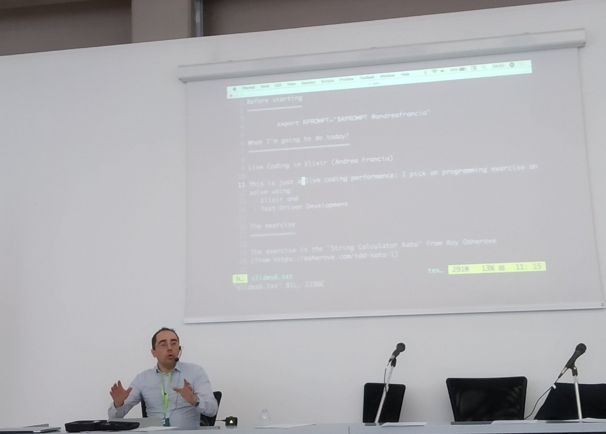

# StringCalculator

This repo contains the code developed live during the: "CODE BEAM LITE ITALY 2019" <https://codesync.global/conferences/code-beam-lite-italy>




# LIVE CODING IN ELIXIR
During this presentation, Andrea will show how to solve the String Calculator Kata, using the test-driven development practice. The problem will be tackled incrementally, explaining each step, describing both the language features and the TDD pattern used.

## OBJECTIVES
To show the basics of Elixir language and explain how using Katas and TDD will help the learning of a new language.

## AUDIENCE
Attendees new to Elixir or interested in how TDD works.

## Contents:

```
What I'm going to do today?
===========================

Live Coding in Elixir (Andrea Francia)

This is just a live coding performance: I pick an programming exercise and I 
solve using:
 - Elixir and 
 - Test-Driven Development

The exercise
============

The exercise is the "String Calculator Kata" from Roy Osherove 
(from https://osherove.com/tdd-kata-1)

The exercise is the following:

   1. Create a simple string calculator function called sum_of/1

   2. The function takes in input a single string
   3. The input string may contains 0,1 or 2 number separated by commas:

      Examples:
         ""
         "1"
         "1,2"
         "1,2,3,4"

   4. The function returns the sum of numbers 
      (for an empty string it will returns 0):

      Examples:
         sum_of("") will return 0
         sum_of("1") will return 1
         sum_of("1,2") will return 3

   5. The function should also handle new lines between numbers (instead of commas).

      Examples:
         sum_of("1\n2")  will return 3
         sum_of("1\n2,3")  will return 6

   8. Support of custom delimiters
       1. to change a delimiter, the beginning of the string will contain a
          separate line that looks like this:   “//[delimiter]\n[numbers…]”
          for example “//;\n1;2” should return three where the default
          delimiter is ‘;’ .
       2. the first line is optional. all existing scenarios should still be supported

   9. Examples:
       
          sum_of("//;\n1;2) will return 3

Notes about the resolution using Test-Driven Development
========================================================

   1. Works incrementally: add a feature at time

   2. When adding a new feature:
      - keep always existing tests passing
      - write a new test demanding the new feature
      - at this point the test is supposed to fail (because is written before
        the relevant feature)
      - watch the test fail
      - make it pass (cheats can be used)
      - make it right (called refactor)

```
